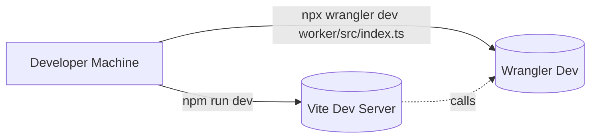

# Copilot instructions — L7 (enhanced)

TL;DR: Client-side SPA (Vanilla TypeScript + Vite) with a Cloudflare Worker proxy to Google Generative Language (Gemini). Primary areas: `frontend/`, `worker/`, and `docs/`.

---

## Visual Architecture 🧭

```mermaid
flowchart LR
  Browser[Browser / Vite SPA]
  Worker[Cloudflare Worker]
  Gemini[Google Gemini API]
  Browser -->|POST ${VITE_WORKER_URL}/chat| Worker
  Worker -->|REST generateContent (x-goog-api-key)| Gemini
  Worker -->|JSON { response }| Browser
```

Developer flow:



---

## Key files & responsibilities 🔎

- `frontend/index.ts` — UI + orchestration: `renderProjects()`, `handleChatSubmit()`, `displayContactForm()`, `addMessage()`, theme toggle, and voice placeholder.
- `frontend/chatbot.ts` — `sendPrompt(prompt)` posts `{ prompt }` to `${VITE_WORKER_URL}/chat` and expects `{ response: string }`.
- `worker/src/index.ts` — CORS handling, rate limiting (`worker/src/rateLimiter.ts`), forwarding the prompt to Gemini, and returning JSON responses.
- `worker/src/rateLimiter.ts` — ephemeral in-memory per-IP sliding window (60s, 10 reqs).
- `docs/AGENTS.md` — assistant persona and orchestration rules.
- `docs/ARCHITECTURE.md` — deeper architecture, Docker, and deployment notes.

---

## High-value patterns & gotchas ⚠️

- Template-literal UI: The app intentionally uses template literals for DOM. Keep the same approach — avoid introducing frameworks or JSX.
- innerHTML risk: `addMessage()` converts markdown and sets `innerHTML`. Any user-provided content must be sanitized. Prefer `textContent` or create DOM nodes for user text.
- Contact flow: `displayContactForm()` only simulates sending. There is no `/contact` worker endpoint — add one if implementing real delivery.
- Secrets: `GEMINI_API_KEY` must remain a worker secret (`wrangler secret` or `.dev.vars`). Never print or return it.
- CORS: Worker compares `Origin` against `ALLOWED_ORIGINS`. Update this when adding new dev/prod domains.
- Rate limiting: The current limiter is local to the worker instance. For production, use Durable Objects or KV for cross-instance limits.

---

## Exact commands (copy/paste) 🛠️

Install:

```pwsh
npm install
npm install --prefix worker
```

Run locally (two terminals):

```pwsh
# Terminal A - frontend
npm run dev

# Terminal B - worker
npx wrangler dev worker/src/index.ts
```

Build & deploy:

```pwsh
npm run build
npm --prefix worker run deploy
# or inside worker/
# npx wrangler deploy
```

---

## Small, targeted patches (examples) ✂️

- Add `/contact` worker endpoint (outline):
  1. Add `POST /contact` branch in `worker/src/index.ts` that validates CORS & rate-limit.
  2. Accept JSON `{ name, email, message }` and call an email provider using a secret (e.g., `SENDGRID_API_KEY`).
  3. Return structured JSON `{ status: 'sent' }` or `{ error: '...' }` and update `frontend/index.ts` to POST to `/contact`.

- Harden `addMessage()` against XSS (recommended minimal change):

  Replace user-content `innerHTML` with safe DOM append:

  ```ts
  const safe = document.createElement('div');
  safe.textContent = userText; // userText is raw text
  bubble.appendChild(safe);
  ```

- Change worker response shape:
  - Update `worker/src/index.ts` to return `{ version: 'v1', response: '...' }` and update `frontend/chatbot.ts` to read `data.response`.

---

## Tests & debugging 🐞

- Run worker tests (Vitest):

```pwsh
npm --prefix worker test
# or
npx vitest
```

- Worker debugging: use `npx wrangler dev worker/src/index.ts` and inspect logs. Do not log secrets.
- Frontend debugging: use browser devtools. Ensure `VITE_WORKER_URL` points to your local wrangler endpoint.

---

## Security & production notes 🔒

- Never commit `GEMINI_API_KEY` or `.dev.vars`.
- For production-rate-limits, replace `worker/src/rateLimiter.ts` with Durable Objects/KV or an API gateway.
- Sanitize all inputs displayed with `innerHTML` to avoid XSS.

---

## PR checklist ✅

- [ ] Small, focused diff (one responsibility per PR).
- [ ] Update both frontend and worker when changing API contracts (`frontend/chatbot.ts` + `worker/src/index.ts`).
- [ ] Update `docs/` when changing runtime behavior or orchestration.
- [ ] Run `npm run build` and smoke-test locally.
- [ ] Verify `wrangler dev` logs show no secret leakage.

---

If you'd like, I can open a draft PR implementing one of the high-value patches (add `/contact`, sanitize `addMessage()`, or add voice input). Which should I do next?
