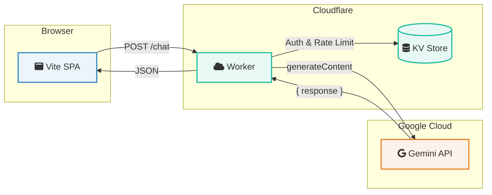
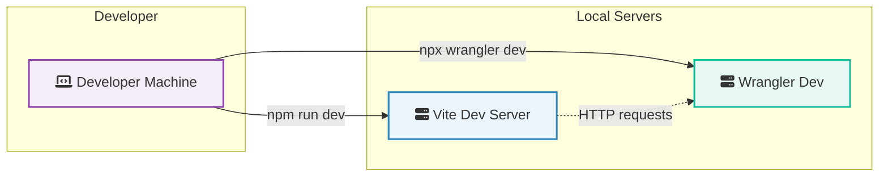

# Copilot instructions — L7 (enhanced)

TL;DR: Client-side SPA (Vanilla TypeScript + Vite) with a Cloudflare Worker proxy to Google Gemini, using KV for rate limiting. Primary areas: `frontend/`, `worker/`, and `docs/`.

---

## Visual Architecture 🧭



Developer flow:



---

## Key files & responsibilities 🔎

- `frontend/index.ts` — UI orchestration, chat history (`localStorage`), theme toggle, and event handling.
- `frontend/chatbot.ts` — `sendPrompt(prompt)` posts to the worker and handles structured JSON responses (`{ response: string }` or `{ error: string }`).
- `worker/src/index.ts` — Main worker entry point. Handles routing, CORS, and calls the Gemini SDK.
- `worker/src/rateLimiter.ts` — KV-backed rate limiting logic.
- `worker/wrangler.toml` — Configuration for the worker, including KV namespace bindings.
- `docs/ARCHITECTURE.md` — Deeper architecture notes.

---

## High-value patterns & gotchas ⚠️

- **KV Namespace:** The rate limiter requires a KV namespace named `RATE_LIMIT_KV`. Ensure it's created and the ID is in `wrangler.toml`.
- **Structured JSON:** The worker now returns structured JSON (`{ response: text }` on success, `{ error: message }` on failure). The frontend must handle both cases.
- **Chat Persistence:** Chat history is now saved to `localStorage` in `frontend/index.ts`.
- **Gemini SDK:** The worker uses the `@google/generative-ai` SDK, not a direct `fetch` call to the API.
- **Secrets:** `GEMINI_API_KEY` and `ALLOWED_ORIGINS` remain critical secrets.

---

## Exact commands (copy/paste) 🛠️

Install:

```pwsh
npm install
npm install --prefix worker
```

Setup (one-time):

```pwsh
# Create the KV namespace for rate limiting
npx wrangler kv:namespace create RATE_LIMIT_KV
# Note the "id" from the output and add it to worker/wrangler.toml
```

Run locally (two terminals):

```pwsh
# Terminal A - frontend
npm run dev

# Terminal B - worker
npx wrangler dev worker/src/index.ts --local
```

Build & deploy:

```pwsh
npm run build
npm --prefix worker run deploy
```

---

## Small, targeted patches (examples) ✂️

- **Add `/contact` endpoint:**
  1. Add a `POST /contact` route in `worker/src/index.ts`.
  2. Use an email provider (e.g., MailChannels, SendGrid) to send the email.
  3. Update `frontend/index.ts` `displayContactForm` to POST to this new endpoint.

- **Implement Streaming:**
  1. Modify `worker/src/index.ts` to use `model.generateContentStream()`.
  2. Return a `ReadableStream` from the worker.
  3. Update `frontend/chatbot.ts` to read the stream and append text to the message bubble in real-time.

---

## Tests & debugging 🐞

- Run worker tests (Vitest):

```pwsh
npm --prefix worker test
```

- **Local Worker Debugging:** Use `npx wrangler dev worker/src/index.ts --local` to test with a local `kv` directory for the KV namespace.
- **Frontend Debugging:** Use browser devtools. Ensure `VITE_WORKER_URL` points to your local wrangler instance.

---

## Security & production notes 🔒

- **KV Namespace ID:** Do not commit the production KV namespace ID if the repository is public. Use environment variables or a separate configuration for production deployments.
- **Sanitize Inputs:** Continue to sanitize any user-provided content rendered with `innerHTML`.

---

## PR checklist ✅

- [ ] Small, focused diff (one responsibility per PR).
- [ ] Update both frontend and worker when changing API contracts.
- [ ] Update `docs/` when changing runtime behavior.
- [ ] Run `npm run build` and `npm --prefix worker test` locally.
- [ ] Verify `wrangler dev` logs show no secret leakage.
