# AI-Powered Portfolio 🚀

<!-- Badges -->
[](https://opensource.org/licenses/MIT)
[](https://vitejs.dev/)
[](https://www.typescriptlang.org/)
[](https://ai.google.dev/)
[](https://github.com/Gmpho/AI-powered-Static-portfolio/actions/workflows/static.yml)
[](https://dash.cloudflare.com/) <!-- Placeholder, needs actual status badge if available -->

An interactive portfolio that leverages the Gemini API to provide a dynamic, conversational experience. This is not just a static portfolio; it's an interactive application where users can chat with an AI assistant to learn more about my work.

## 💡 Problem Solved

Traditional portfolios are static and passive. This project transforms the conventional portfolio into an engaging, interactive experience, allowing visitors to directly query an AI assistant about projects and skills, providing a deeper, more personalized understanding of my work.

## 📖 Table of Contents

*   [✨ Features](#-features)
*   [🛠️ Technology Stack](#️-technology-stack)
*   [🏗️ Architecture](#️-architecture)
*   [🚀 Quick Start](#-quick-start)
*   [🐳 Docker](#-docker)
*   [📸 Visual Demo](#-visual-demo)
*   [🤝 Contributing](#-contributing)
*   [📄 License](#-license)
*   [📞 Contact](#-contact)

## ✨ Features

-   **🤖 Conversational AI Chatbot:** Engage directly with an AI assistant powered by the cutting-edge Gemini API to explore projects and gain insights.
-   **🎨 Dynamic Project Showcase:** A clean, modern interface designed to beautifully present diverse portfolio projects.
-   **🔍 Intelligent Semantic Search:** Leverage AI to semantically search for projects based on natural language queries, providing highly relevant results.
-   **📝 Seamless Contact Integration:** The chatbot can intuitively guide users to an interactive contact form, simplifying communication.
-   **💾 Persistent Conversations:** Chat history is automatically saved to `localStorage`, ensuring continuity across sessions.
-   **🎤 Intuitive Voice Input:** Interact hands-free with the chatbot using integrated voice-to-text functionality via the Web Speech API.
-   **🌗 Adaptive Light/Dark Mode:** Personalize your viewing experience with a toggle for light and dark themes.

## 🛠️ Technology Stack

This project is built with a selection of modern and efficient technologies, chosen for their performance, flexibility, and developer experience.

-   **Frontend**: TypeScript, HTML5, CSS3 (No framework, uses JavaScript template literals for HTML templating)
-   **AI Layer**: Cloudflare Workers (for secure API proxy, calling Google Gemini API directly), Google Gemini API
-   **Speech Recognition**: Web Speech API

# 🏗️ Architecture

The application is a **client-side, single-page application (SPA)** that interacts directly with the Google Gemini API from the user's browser.

## Diagram




## Layers

### 🎨 Presentation Layer (UI)

*   **Technologies:** Vanilla TypeScript, HTML, CSS.
*   **Responsibilities:** Renders the main portfolio page, including the header, hero section, and project cards. It also provides the user interface for the chatbot, including the chat window, message history, and input form. All UI manipulation is handled directly via the DOM.

### 🧠 Application Logic Layer (Client-Side)

*   **Technologies:** TypeScript.
*   **Responsibilities:** This is the core of the application, running entirely in the user's browser.
    *   **State Management:** Manages the application state, such as the conversation history.
    *   **AI Integration:** Handles communication with the Cloudflare Worker, which securely calls the Google Gemini API directly.
    *   **Orchestration Logic:** Contains the logic to interpret user intent based on keywords.
    *   **Data Persistence:** Uses the browser's `localStorage` to save and load the chat history.

### 💾 Data Layer

*   **Project Data:** Project information is currently hardcoded as a constant within the `index.tsx` file.
*   **Conversation History:** Stored in a JavaScript array in memory during the session and persisted to `localStorage`.
*   **Vector Embeddings:** Project embeddings for semantic search are generated at runtime and stored in memory.

### ☁️ Infrastructure & Deployment

*   **Technologies:** Docker, Nginx, GitHub Pages, Cloudflare Workers.
*   **Responsibilities:** The application includes a multi-stage `Dockerfile` for containerization and is configured for automated deployment to GitHub Pages via GitHub Actions. The AI backend is deployed as a Cloudflare Worker.

## 🔐 API Access Model & Security

`Frontend Browser -> Cloudflare Worker -> Google Gemini API`

> **✅ Enhanced Security:** The API key is now securely stored and managed by the Cloudflare Worker, preventing its exposure on the client-side. This approach is suitable for production environments.

## 🚀 Quick Start

1.  **Install dependencies:**
    ```bash
    npm install
    ```

2.  **Set up Environment Variables:**
    *   In the `frontend` directory, create a `.env.local` file with the following content:
        ```
        VITE_WORKER_URL="http://127.0.0.1:8787"
        ```
    *   In the `worker` directory, create a `.dev.vars` file with the following content:
        ```
        GEMINI_API_KEY="YOUR_GOOGLE_AI_STUDIO_KEY_HERE"
        ALLOWED_ORIGINS="http://localhost:5173,http://127.0.0.1:5173"
        ```
    *   Ensure you have a `wrangler.toml` file in your `worker` directory (it was created during debugging).

3.  **Run the development servers:**
    *   In one terminal, start the frontend server:
        ```bash
        npm run dev
        ```
    *   In a second terminal, start the worker server from the root directory of the project:
        ```bash
        npx wrangler dev worker/src/index.ts
        ```

For detailed troubleshooting, refer to the [Debugging and Troubleshooting](GEMINI.md#debugging-and-troubleshooting) section in `GEMINI.md`.

## 🐳 Docker

Containerize this application for consistent and isolated environments using Docker.

**Build the image:**
```bash
# The frontend Docker image does not require the API key.
docker build -t ai-portfolio .
```

**Run the container:**
```bash
docker run -p 8080:80 ai-portfolio
```
The application will be available at `http://localhost:8080`.

## 📸 Visual Demo

Experience the interactive AI-powered portfolio in action:


## 🤝 Contributing

Contributions are welcome! Please see the [CONTRIBUTING.md](CONTRIBUTING.md) for guidelines.

## 📄 License

This project is licensed under the MIT License - see the [LICENSE](LICENSE) file for details.

## 📞 Contact

For questions or feedback, please open an issue or contact me directly.
