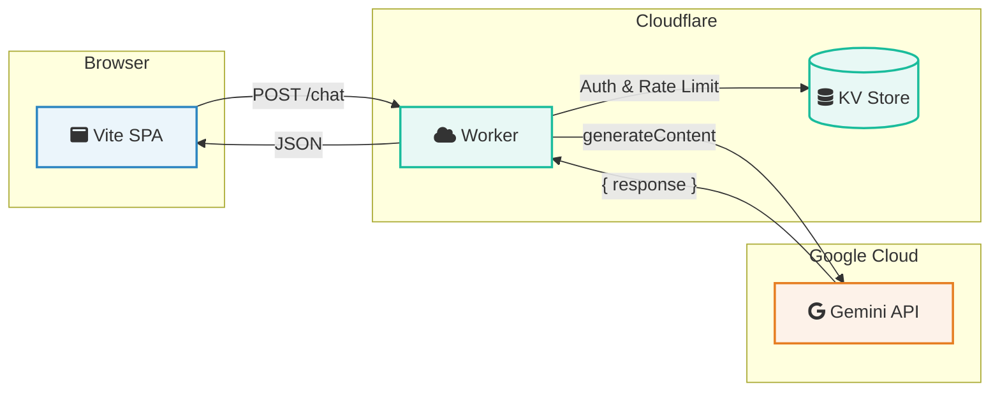

# AI-Powered Portfolio 🚀

<!-- Badges -->
[](https://opensource.org/licenses/MIT)
[](https://vitejs.dev/)
[](https://www.typescriptlang.org/)
[](https://ai.google.dev/)
[](https://playwright.dev/)
[
[](https://dash.cloudflare.com/)

An interactive portfolio that leverages the Gemini API to provide a dynamic, conversational experience. This is not just a static portfolio; it's an interactive application where users can chat with an AI assistant to learn more about my work.

## 💡 Problem Solved

Traditional portfolios are static and passive. This project transforms the conventional portfolio into an engaging, interactive experience, allowing visitors to directly query an AI assistant about projects and skills, providing a deeper, more personalized understanding of my work.

## 📖 Table of Contents

*   [✨ Features](#-features)
*   [🛠️ Technology Stack](#️-technology-stack)
*   [🏗️ Architecture](#️-architecture)
*   [🧪 Testing](#-testing)
*   [📚 Documentation](#-documentation)
*   [🔐 API Access Model & Security](#-api-access-model--security)
*   [🚀 Quick Start](#-quick-start)
*   [🐳 Docker](#-docker)
*   [📸 Visual Demo](#-visual-demo)
*   [🤝 Contributing](#-contributing)
*   [📄 License](#-license)
*   [📞 Contact](#-contact)

## ✨ Features

-   **🤖 Conversational AI Chatbot:** Engage directly with an AI assistant powered by the cutting-edge Gemini API to explore projects and gain insights.
-   **🎨 Dynamic Project Showcase:** A clean, modern interface designed to beautifully present diverse portfolio projects.
-   **🔍 Intelligent Semantic Search (Planned):** Leverage AI to semantically search for projects based on natural language queries, providing highly relevant results. This feature is under active development.
-   **📝 Seamless Contact Integration:** The chatbot can intuitively guide users to an interactive contact form, simplifying communication.
-   **💾 Session-based Conversations:** Chat history is automatically saved to `sessionStorage`, ensuring continuity within a single browser tab and clearing upon tab closure.
-   **🎤 Intuitive Voice Input:** Interact hands-free with the chatbot using integrated voice-to-text functionality via the Web Speech API.
-   **🌗 Adaptive Light/Dark Mode:** Personalize your viewing experience with a toggle for light and dark themes.

## 🛠️ Technology Stack

This project is built with a selection of modern and efficient technologies, chosen for their performance, flexibility, and developer experience.

-   **Frontend**: TypeScript, HTML5, CSS3 (No framework, uses JavaScript template literals for HTML templating)
-   **AI Layer**: Cloudflare Workers (secure API proxy, rate limiting, guardrails, embedding generation, calling Google Gemini API directly), Google Gemini API (using `gemini-2.5-flash` model)
-   **Testing**: Playwright (for End-to-End testing), Vitest (for Worker unit testing)
-   **Speech Recognition**: Web Speech API

# 🏗️ Architecture

The application is a **client-side, single-page application (SPA)** that interacts directly with the Google Gemini API from the user's browser.

## Diagram

For a better viewing experience on GitHub, the diagram is rendered from a `.mmd` file. It includes icons, which require Font Awesome to be available in the rendering environment.



### Cloudflare Worker Endpoints

The Cloudflare Worker acts as a secure proxy and backend for AI-related functionalities, exposing the following key endpoints:

*   `/chat`: Handles conversational requests, forwarding them to the Gemini API, applying rate limiting, and enforcing guardrails to prevent sensitive content injection.
*   `/embed`: Generates vector embeddings for text, also protected by rate limiting and guardrails. This endpoint is designed for internal use by the application (e.g., for semantic search) and not for direct client access.


## Layers

### 🎨 Presentation Layer (UI)

* **Technologies:** Vanilla TypeScript, HTML, CSS.
* **Responsibilities:** Renders the main portfolio page, including the header, hero section, and project cards. It also provides the user interface for the chatbot, including the chat window, message history, and input form. All UI manipulation is handled directly via the DOM.

### 🧠 Application Logic Layer (Client-Side)

* **Technologies:** TypeScript.
* **Responsibilities:** This is the core of the application, running entirely in the user's browser.
  * **State Management:** Manages the application state, such as the conversation history.
  * **AI Integration:** Handles communication with the Cloudflare Worker, which processes and simplifies the Gemini API's raw response before sending a clean, structured response to the frontend.
  * **Orchestration Logic:** Contains the logic to interpret user intent based on keywords.
  * **Data Persistence:** Uses the browser's `localStorage` to save and load the chat history.

### 💾 Data Layer

* **Project Data:** Project information is currently hardcoded as a constant within the `index.tsx` file.
* **Conversation History:** Stored in a JavaScript array in memory during the session and persisted to `localStorage`.
* **Vector Embeddings:** Project embeddings for semantic search are generated at runtime and stored in memory.

### ☁️ Infrastructure & Deployment

* **Technologies:** Docker, Nginx, GitHub Pages, Cloudflare Workers.
* **Responsibilities:** The application includes a multi-stage `Dockerfile` for containerization and is configured for automated deployment to GitHub Pages via GitHub Actions. The AI backend is deployed as a Cloudflare Worker.

## 🔐 API Access Model & Security

`Frontend Browser -> Cloudflare Worker -> Google Gemini API`

> **✅ Enhanced Security:** The `GEMINI_API_KEY` and `ALLOWED_ORIGINS` are securely stored as **Cloudflare Worker secrets**, preventing their exposure. The `VITE_WORKER_URL` for the frontend is stored as a **GitHub repository secret**. This robust approach is suitable for production environments.

## 🧪 Testing

To ensure the reliability and quality of the application, a comprehensive testing strategy is employed:

*   **End-to-End (E2E) Testing with Playwright:**
    *   Simulates real user interactions in a browser to validate the entire application workflow, including UI, application logic, and API integrations.
    *   Covers key scenarios like general conversation, contact form submission, **rate limiting, and guardrail enforcement.**
    *   All E2E tests are currently passing (with one test for semantic search intentionally skipped as the feature is under development).
    *   **To run E2E tests:**
        ```bash
        npx playwright test
        ```
*   **Worker Unit Testing with Vitest:**
    *   Ensures the individual components and logic of the Cloudflare Worker function correctly.
    *   All worker unit tests are currently passing. A critical bug related to the Gemini model was recently identified and fixed, and all tests continue to pass after the resolution, ensuring the chatbot's stability.
    *   **To run Worker unit tests:**
        ```bash
        npm test --prefix worker
        ```

## 🚀 Quick Start

1. **Install dependencies:**
   * Run `npm install` in the project root.
   * Run `npm install --prefix worker` in the project root to install worker-specific dependencies.

2. **Set up Environment Variables (Development):**
   * In the `frontend` directory, create a `.env.local` file with the following content:

     ```env
     VITE_WORKER_URL="http://127.0.0.1:8787"
     ```

   * In the `worker` directory, create a `.dev.vars` file with the following content:

     ```env
     GEMINI_API_KEY="YOUR_GOOGLE_AI_STUDIO_KEY_HERE"
     ALLOWED_ORIGINS="http://localhost:5173,http://127.0.0.1:5173"
     ```

3. **Set up Environment Variables (Production):**
   * **Cloudflare Worker Secrets:**
     * `GEMINI_API_KEY`: Your Google AI Studio key (set via `npx wrangler secret put GEMINI_API_KEY`).
     * `ALLOWED_ORIGINS`: Your GitHub Pages URL (e.g., `https://gmpho.github.io`) (set via `npx wrangler secret put ALLOWED_ORIGINS`).
   * **GitHub Repository Secret:**
     * `VITE_WORKER_URL`: The URL of your deployed Cloudflare Worker (e.g., `https://ai-powered-static-portfolio-worker.<YOUR_ACCOUNT_NAME>.workers.dev`) (set via `gh secret set VITE_WORKER_URL`).

4. **Run the development servers:**
   * In one terminal, start the frontend server:

     ```bash
     npm run dev
     ```

   * In a second terminal, start the worker server from the project root:

     ```bash
     npx wrangler dev worker/src/index.ts
     ```

For detailed troubleshooting, refer to the [Debugging and Troubleshooting](GEMINI.md#debugging-and-troubleshooting) section in `GEMINI.md` and the [Known Issues](docs/KNOWN_ISSUES.md) document for specific resolutions.

## 🐳 Docker

Containerize this application for consistent and isolated environments using Docker.

**Build the image:**
```bash
# The frontend Docker image does not require the API key.
docker build -t ai-portfolio .
```

**Run the container:**
```bash
docker run -p 8080:80 ai-portfolio
```
The application will be available at `http://localhost:8080`.

## 📸 Visual Demo

Experience the interactive AI-powered portfolio in action:


## 🤝 Contributing

Contributions are welcome! Please see the [CONTRIBUTING.md](CONTRIBUTING.md) for guidelines.

## 📄 License

This project is licensed under the MIT License - see the [LICENSE](LICENSE) file for details.

## 📞 Contact

For questions or feedback, please open an issue or contact me directly.

<!-- Deployed: 2025-09-22 -->
