# 🤖 Agent Architecture and Future Enhancements

The "AI Assistant" in this project is a simple precursor to a more advanced AI "agent." An agent uses a Large Language Model (LLM) as a reasoning engine to decide which actions to take. This approach is heavily inspired by and could be evolved using concepts from frameworks like **LangChain**.

## 🤔 What is an Agent?

An agent is a system that uses an LLM to:

1.  **🧠 Reason:** Analyze a user's request to understand the underlying intent.
2.  **📝 Plan:** Break down the request into a series of steps.
3.  **🛠️ Act:** Choose and execute a **tool** to perform a specific action for each step.
4.  **👀 Observe:** Evaluate the result of the tool's execution.
5.  **🔁 Repeat:** Continue this process until the user's original request is fulfilled.

### Diagram

```mermaid
graph TD
    A[User Request] --> B{🧠 LLM Reason};
    B --> C[📝 Plan];
    C --> D{🛠️ Tool};
    D --> E[👀 Observe];
    E --> B;
```

## 🔗 How This Project Relates to the Agent Concept

The current implementation is a significant step towards a true agent. The LLM (Gemini) now actively chooses which tools to call based on user intent, with the Cloudflare Worker acting as the orchestrator and executor.

- **LLM as Reasoning Engine:** The project now uses the Gemini API not just as a conversational engine, but as the core reasoning engine for actions, leveraging its function calling capabilities.
- **Worker-Orchestrated Tools:** The functions for searching projects or showing a contact form are now true `Tools` orchestrated by the worker. The worker receives the tool call from Gemini, executes the corresponding logic, and returns the result.
- **LLM-Driven Orchestration:** The application's `handleChatSubmit` function (in the frontend) sends user prompts to the worker. The worker, in turn, uses the Gemini model to decide which tool to run, effectively shifting the orchestration logic from hardcoded client-side `if/else` to the LLM itself.

## 🛣️ Path to a True Agent

This project has made significant progress towards a true agent architecture. The orchestration logic has been successfully shifted from the client-side code to the LLM itself, with the Cloudflare Worker acting as the agent executor.

1.  **☁️ Moving Logic to a Backend (Cloudflare Worker):** This has been fully implemented. The existing Cloudflare Worker now securely handles all AI calls (chat and embedding generation) and manages tools and API keys.
2.  **📖 Describing Tools to the LLM:** This has been fully implemented. The Gemini model is now provided with a list of available tools and descriptions of what they do and what parameters they accept.
3.  **🤖 Letting the LLM Decide:** This has been fully implemented. The Gemini model now responds with a JSON object specifying which tool to call based on the user's query, and the backend executes that tool.

Frameworks like LangChain.js are designed to simplify this exact process, providing a robust structure for building powerful, tool-using agents.
