```mermaid
graph TD
    A[User Request] --> B{🧠 LLM Reason};
    B --> C[📝 Plan];
    C --> D{🛠️ Tool};
    D --> E[👀 Observe];
    E --> B;
```

# 🤖 Agent Architecture and Future Enhancements

The "AI Assistant" in this project is a simple precursor to a more advanced AI "agent." An agent uses a Large Language Model (LLM) as a reasoning engine to decide which actions to take. This approach is heavily inspired by and could be evolved using concepts from frameworks like **LangChain**.

## 🤔 What is an Agent?

An agent is a system that uses an LLM to:

1.  **🧠 Reason:** Analyze a user's request to understand the underlying intent.
2.  **📝 Plan:** Break down the request into a series of steps.
3.  **🛠️ Act:** Choose and execute a **tool** to perform a specific action for each step.
4.  **👀 Observe:** Evaluate the result of the tool's execution.
5.  **🔁 Repeat:** Continue this process until the user's original request is fulfilled.

### Diagram

## 🔗 How This Project Relates to the Agent Concept

The current implementation is **not a true agent** because the LLM does not choose the actions. Instead, the application uses simple `if/else` logic based on keywords to decide which "tool" (a client-side function) to run.

- **LLM as Conversational Engine:** The project currently uses the Gemini API as a high-quality response generator, but not as the core reasoning engine for actions.
- **Simulated Tools:** The functions for searching projects or showing a contact form are the equivalent of LangChain's `Tools`. They are discrete, single-purpose functions.
- **Hardcoded Orchestration:** The application's `handleChatSubmit` function acts as a simple, hardcoded "Agent Executor." It is responsible for deciding which tool to run.

## 🛣️ Path to a True Agent

To evolve this project into a true agent architecture, the orchestration logic would need to be shifted from the client-side code to the LLM itself. This would involve:

# 🤖 Agent Architecture and Future Enhancements

The "AI Assistant" in this project is a simple precursor to a more advanced AI "agent." An agent uses a Large Language Model (LLM) as a reasoning engine to decide which actions to take. This approach is heavily inspired by and could be evolved using concepts from frameworks like **LangChain**.

## 🤔 What is an Agent?

An agent is a system that uses an LLM to:

1.  **🧠 Reason:** Analyze a user's request to understand the underlying intent.
2.  **📝 Plan:** Break down the request into a series of steps.
3.  **🛠️ Act:** Choose and execute a **tool** to perform a specific action for each step.
4.  **👀 Observe:** Evaluate the result of the tool's execution.
5.  **🔁 Repeat:** Continue this process until the user's original request is fulfilled.

### Diagram

## 🔗 How This Project Relates to the Agent Concept

The current implementation is **not a true agent** because the LLM does not choose the actions. Instead, the application uses simple `if/else` logic based on keywords to decide which "tool" (a client-side function) to run.

- **LLM as Conversational Engine:** The project currently uses the Gemini API as a high-quality response generator, but not as the core reasoning engine for actions.
- **Simulated Tools:** The functions for searching projects or showing a contact form are the equivalent of LangChain's `Tools`. They are discrete, single-purpose functions.
- **Hardcoded Orchestration:** The application's `handleChatSubmit` function acts as a simple, hardcoded "Agent Executor." It is responsible for deciding which tool to run.

## 🛣️ Path to a True Agent

To evolve this project into a true agent architecture, the orchestration logic would need to be shifted from the client-side code to the LLM itself. This would involve:

1.  **☁️ Moving Logic to a Backend (Cloudflare Worker):** This has largely been implemented. The existing Cloudflare Worker now securely handles all AI calls (chat and embedding generation) and can manage tools and API keys.
2.  **📖 Describing Tools to the LLM:** Provide the Gemini model with a list of available tools and descriptions of what they do and what parameters they accept.
3.  **🤖 Letting the LLM Decide:** Prompt the Gemini model to respond with a JSON object specifying which tool to call based on the user's query. The backend would then execute that tool.

Frameworks like LangChain.js are designed to simplify this exact process, providing a robust structure for building powerful, tool-using agents.  2. **📖 Describing Tools to the LLM:** Provide the Gemini model with a list of available tools and descriptions of what they do and what parameters they accept. 3. **🤖 Letting the LLM Decide:** Prompt the Gemini model to respond with a JSON object specifying which tool to call based on the user's query. The backend would then execute that tool.

Frameworks like LangChain.js are designed to simplify this exact process, providing a robust structure for building powerful, tool-using agents.
