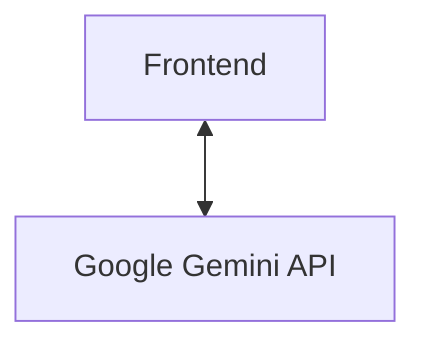
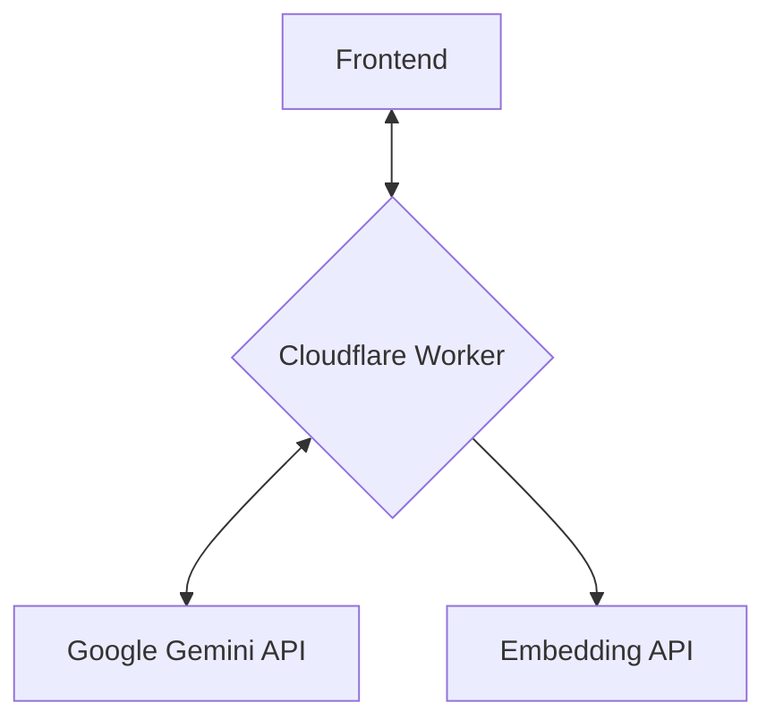

# 🚀 From Direct API Calls to a Control Plane

The initial architecture of this application involved direct, client-side calls to the Gemini API. While simple for development, this approach had limitations in security and scalability. The project has since introduced a basic backend layer using a **Cloudflare Worker**, which serves as a foundational **Model Control Plane (MCP)**.

## 🔒 Previous Architecture: Direct API Access

### Diagram



- **👍 Pros:** Simple to set up, no backend infrastructure required.
- **👎 Cons:**
  - **Insecure:** The API key was exposed on the client side.
  - **Limited:** Could not securely connect to other tools or services (like a database or a private API).
  - **Brittle:** Complex logic for choosing between different actions (like search vs. chat) lived on the client and could become difficult to manage.

## ☁️ Current Architecture: Cloudflare Worker as Basic MCP

### Diagram



- **👍 Pros:**
  - **Secure:** API key is now securely stored and managed by the Cloudflare Worker.
  - **Scalable:** Offloads AI processing (chat and embedding generation) from the client.
  - **Flexible:** Provides a secure endpoint for future tool orchestration.
- **👎 Cons:**
  - Still requires client-side logic for tool orchestration (not a true agent).

## ☁️ Future Architecture: Evolving the Backend Control Plane

To evolve this into a more comprehensive and intelligent MCP, the backend would further expand its responsibilities.

### Diagram

```mermaid
graph TD
    A[Frontend] <--> B{Backend Server (Control Plane)};
    B <--> C[Gemini API];
    B <--> D[Other Tools];
    B <--> E[Databases];
```

### ✅ Core Responsibilities of a Backend Control Plane

1.  **Secure API Gateway:**
    - The primary role of the backend is to act as a secure gateway. The frontend communicates only with your backend server. The backend, running in a secure environment, is responsible for making calls to external services like the Gemini API.
    - This design ensures that sensitive API keys are never exposed on the client-side.

2.  **Tool Orchestration:**
    - A backend is the perfect place to manage and orchestrate a suite of tools.
    - Instead of the client having `if/else` logic, the user prompt can be sent to the backend. The backend, with the help of the Gemini model, can then determine the user's intent and decide which tool (e.g., database query, search API call) to execute.

3.  **Decoupling and Scalability:**
    - By using a backend, the frontend is completely decoupled from the application logic. New tools or complex workflows can be added to the backend without requiring any changes to the frontend code. This makes the application highly modular and scalable.
