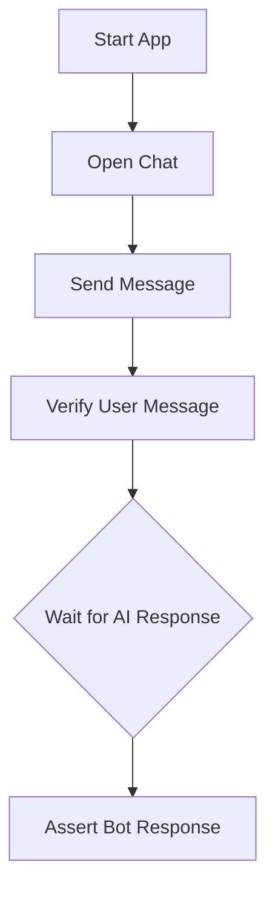

# 🧪 Testing Protocol: A Comprehensive Approach

To ensure the reliability and quality of this application, a robust testing strategy is essential. This project now includes a comprehensive test suite, covering both end-to-end and unit/integration testing.

## 🤖 End-to-End (E2E) Testing with Playwright

E2E testing is critical for an application like this because it validates the entire workflow from the user's perspective. It simulates real user interactions in a browser, ensuring that the UI, application logic, and API integrations all work together correctly. **This includes interactions with the deployed Cloudflare Worker for AI responses.**

### Diagram

### 🔑 Key E2E Test Scenarios Implemented

A foundational test suite covers the application's main features:

- **💬 General Conversation:**
  - **Trigger:** User sends a simple greeting like "Hello".
  - **Expected Result:** The test asserts that the bot replies with a conversational response.

- **🔍 Project Search:**
  - **Trigger:** User sends a message like "Find a project about TypeScript".
  - **Expected Result:** The test asserts that the bot's response contains the name and description of a relevant project, leveraging the semantic search functionality.

- **📝 Contact Form:**
  - **Trigger:** User sends a message like "How can I contact you?".
  - **Expected Result:** The test asserts that the contact form is rendered within the chat window. It then proceeds to fill out and submit the form, verifying the success message.

- **📚 Conversation History:**
  - **Trigger:** A test that involves multiple message exchanges.
  - **Expected Result:** The test asserts that the bot's later responses are contextually aware of the earlier messages in the conversation.

- **🔒 Rate Limiting:**
  - **Trigger:** Rapidly send more requests than the defined rate limit to the chatbot.
  - **Expected Result:** The application should display a `429 Too Many Requests` error or a user-friendly message indicating rate limiting, and subsequent requests should be blocked until the `Retry-After` period expires.

- **🛡️ Guardrails (Sensitive Content Blocking):**
  - **Trigger:** Send a message containing known sensitive patterns (e.g., `curl`, `api_key=`, `-----BEGIN`).
  - **Expected Result:** The application should display an error message indicating that sensitive content was detected and the request was blocked, without processing the message further.

- **🎨 Project Showcase:**
  - **Trigger:** User clicks the "Load More" button.
  - **Expected Result:** The test asserts that more projects are loaded and displayed on the page.

## 🧪 Worker Unit Testing with Vitest

Unit and integration tests for the Cloudflare Worker are implemented using Vitest. These tests ensure the individual components and logic of the worker function correctly and reliably.

### 🔑 Key Worker Test Scenarios Implemented

- **API Endpoints:**
  - `/`: Returns a 200 OK with API status HTML.
  - `/health`: Returns 200 OK with Gemini API key and KV status.
  - `/chat`: Handles valid/invalid prompts, streaming responses, tool calls, and missing API keys.
  - `/contact`: Handles valid/invalid contact form submissions.
  - `/api/generateEmbedding`: Handles valid/invalid embedding requests.
- **Security:**
  - **CORS:** Verifies correct CORS header handling for allowed and disallowed origins, including preflight requests.
  - **Guardrails:** Tests `checkInjection` for various malicious patterns and `sanitizeOutput` for stripping HTML, redacting secrets, and removing data URIs.
  - **Rate Limiting:** Verifies `checkRateLimit` functionality, including allowing requests up to the limit, denying exceeding requests, resetting limits, and handling multiple IPs independently.
- **Error Handling:** Ensures appropriate error responses for method not allowed, not found, and server configuration issues.

All E2E and worker unit tests are currently passing, providing high confidence in the application's functionality and security.
