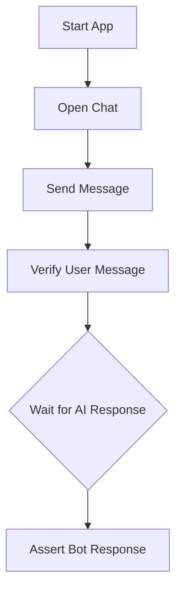

# 🧪 Testing Protocol: A Recommended Approach

To ensure the reliability and quality of this application, especially as new features are added, a robust testing strategy is essential. While this project does not currently include a test suite, the recommended approach is to use a modern end-to-end (E2E) testing framework like **Playwright**.

## 🤔 Why End-to-End Testing?

E2E testing is critical for an application like this because it validates the entire workflow from the user's perspective. It simulates real user interactions in a browser, ensuring that the UI, application logic, and API integrations all work together correctly.

## 🤖 Recommended Core Testing Workflow with Playwright

A Playwright test suite would automate the following workflow:

### Diagram

## 🔑 Key E2E Test Scenarios to Implement

A foundational test suite should cover the application's main features:

*   **💬 General Conversation:**
    *   **Trigger:** User sends a simple greeting like "Hello".
    *   **Expected Result:** The test asserts that the bot replies with a conversational response.

*   **🔍 Project Search:**
    *   **Trigger:** User sends a message like "Find a project about TypeScript".
    *   **Expected Result:** The test asserts that the bot's response contains the name and description of a relevant project.

*   **📝 Contact Form:**
    *   **Trigger:** User sends a message like "How can I contact you?".
    *   **Expected Result:** The test asserts that the contact form is rendered within the chat window. It could then proceed to fill out and submit the form, verifying the success message.

*   **📚 Conversation History:**
    *   **Trigger:** A test that involves multiple message exchanges.
    *   **Expected Result:** The test asserts that the bot's later responses are contextually aware of the earlier messages in the conversation.